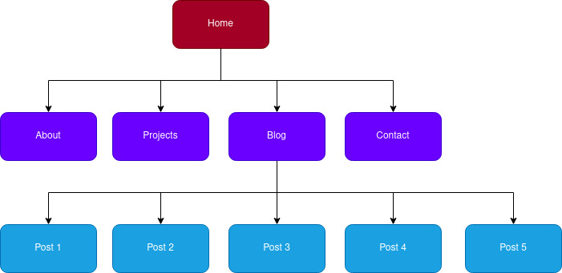

# Portfolio Site
Git Repository for my Portfolio website

## Git Repository

[https://github.com/theandrewfulton/portfolio-site](https://github.com/theandrewfulton/portfolio-site)

## Link to Portfolio

The published portfolio site can be found [here](https://theandrewfulton.netlify.app)

## Purpose

The purpose of this portfolio site is to showcase my skills, projects, work history, and to a certain degree my personality to potential employers, collaborators and clients. It needs to do this in a functional, well laid out, clear and concise manner.

## Functionality and Features

This site features responsive design sections and elements that adjust based on the size of the user's screen. This is particularly noticable in the different menu layouts for phones, tablets and computers. It is also designed to be more easily acessible to visitors with screen readers, featuring semantic HTML throughout. Site security has also been considered, with Subresource Integrity implemented for links and resources throughout the site.

The portfolio site contains a link to my Resume as a pdf on the About page and also features Projects and Blog pages, enabling me to showcase my achievements, knowledge and experience in the future, beyond just my Resume.

## Sitemap

## Screenshots

## Target Audience

The target audience for this portfolio site are recruiters and potential employers, clients and collaborators who may be interested in engaging me professionally in some form.

A second target audience are my friends, family and colleagues who are interested in following my journey training as a web developer.

## Tech Stack

The portfolio is written in HTML5, with styling in SASS, which is then transpiled into CSS. Changes to the source code (along with this documentation) were tracked using Git and hosted on GitHub, with commits to the *main* branch automatically deployed to the live site hosted on Netlify.